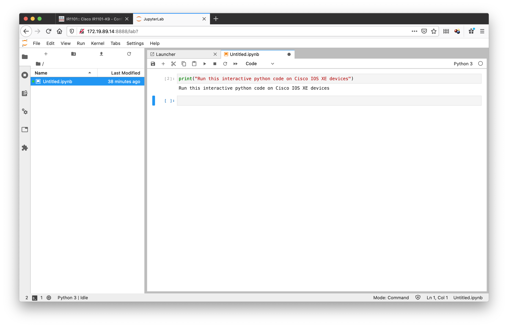
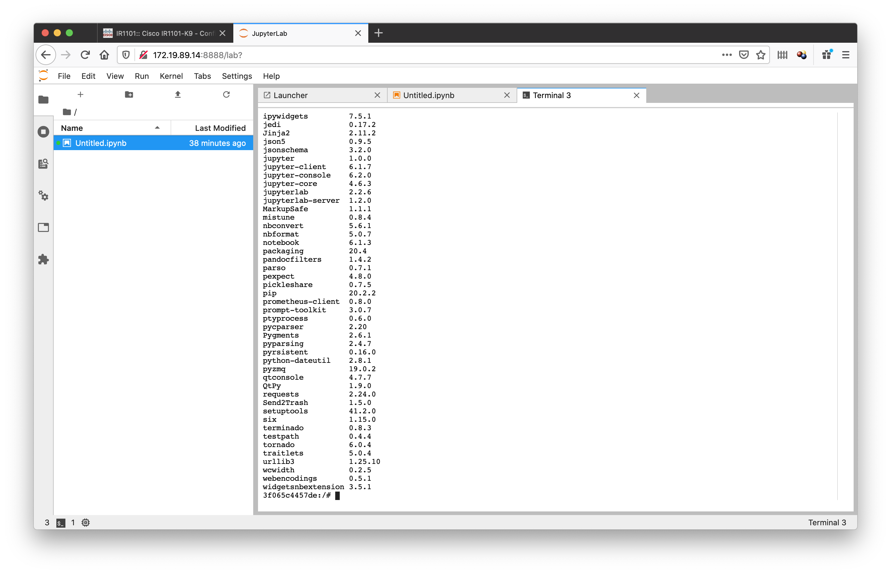
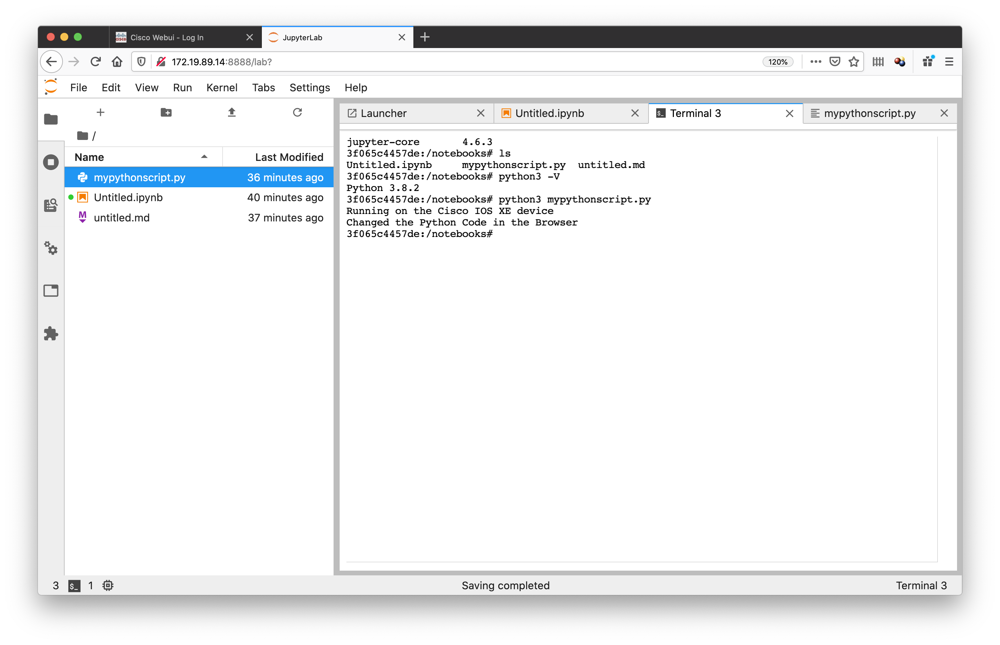
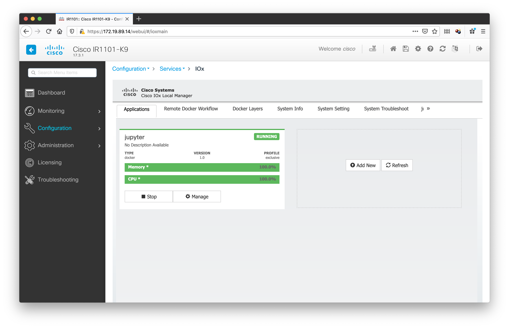

# IOx-App: Run Python Scripts on Cisco Device, edit via Browser

If you would like to test your python scripts directly on your Cisco Hardware, you can do this now with this simple IOx Application!

With the Open Source software **Jupyter Lab** you can create and edit your Python scripts in your web-browser via a simple editor and interactively. Furthermore, you can install additional python libraries as well.

> Also compatible with the **IR1101** on ARM platform!

## Getting Started

1. Install Docker for your machine
2. Download the Dockerfile from this repo and choose which architecture you would like to build the container for:

```
# uncomment one of the lines to select x86 or ARM
FROM alpine:latest
#FROM arm64v8/alpine:latest
```
**Be aware**: Depending on your local machine it may take longer to compile some packages and create the ARM Docker container.

3. Build and export your created Docker image and save it to a .tar package.

```
docker build -t jupyter .
docker save jupyter > ioxapp.tar
```

4. Install the Docker Container directly on your hardware if supported, or use ioxclient. For more information, please refer to the [IOx Documentation page](https://developer.cisco.com/docs/iox/).

*ONLY FOR TESTING + OWN RISK: You can find pre-compiled packages under Releases.*

## Supported Features

### Run interactive Python scripts


### Install additional libraries via pip


### Latest Python version is supported


### Also supported on the IR1101


## Versioning

**1.0** - Added Dockerfile and documentation

## Authors

* **Florian Pachinger** - *Initial work* - [flopach](https://github.com/flopach)

## License

This project is licensed under the Apache License 2.0 - see the [LICENSE.md](LICENSE.md) file for details.

## Further Links

* [Cisco DevNet Website](https://developer.cisco.com)
* [Jupyter Website](https://jupyter.org/)
* [Jupyter Lab Documentation](https://jupyterlab.readthedocs.io/en/latest/)